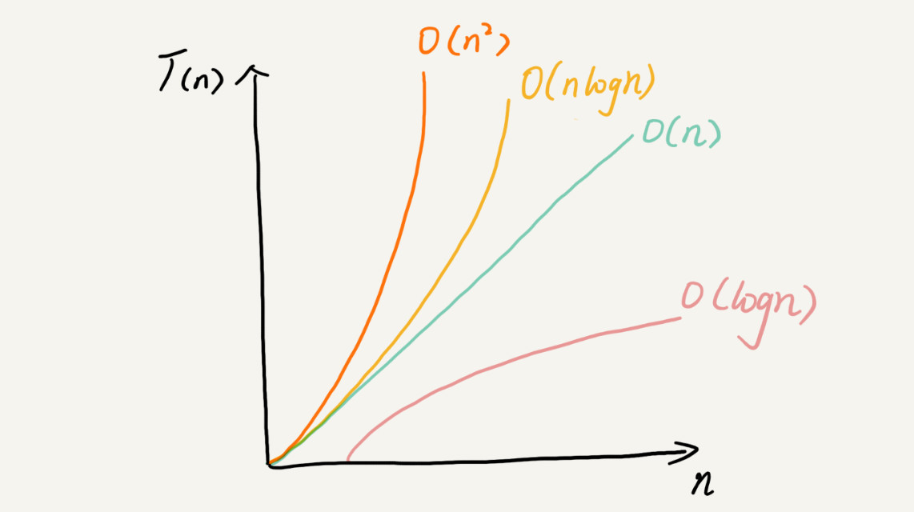

时间和空间复杂度分析方法

性能测试容易受环境所影响，所以需要学习时间和空间复杂度，对比代码执行效率。

## 大O复杂度表示法

算法的执行效率，粗略地讲，就是算法代码执行的时间。


```java
 int cal(int n) {
   int sum = 0;
   int i = 1;
   for (; i <= n; ++i) {
     sum = sum + i;
   }
   return sum;
 }
```

> 求 1,2,3…n 的累加和


从 CPU 的角度来看，这段代码的每一行都执行着类似的操作：读数据-运算-写数据。尽管每行代码对应的 CPU 执行的个数、执行的时间都不一样，但是，我们这里只是粗略估计，所以可以假设每行代码执行的时间都一样，为 unit_time。

第 2、3 行代码分别需要 1 个 unit_time 的执行时间，第 4、5 行都运行了 n 遍，所以需要 `2n*unit_time` 的执行时间，所以这段代码总的执行时间就是`(2n+2)*unit_time`。可以看出来，所有代码的执行时间 T(n) 与每行代码的执行次数成正比。


```java
 int cal(int n) {
   int sum = 0;
   int i = 1;
   int j = 1;
   for (; i <= n; ++i) {
     j = 1;
     for (; j <= n; ++j) {
       sum = sum +  i * j;
     }
   }
 }
```

第 2、3、4 行代码，每行都需要 1 个 unit_time 的执行时间，共计3行代码。第 5、6 行代码循环执行了 n 遍，共计2行代码需要`n+n`即` 2n * unit_time`的执行时间，第 7、8 行代码循环执行了 n^2遍，共计2行代码需要`n^2+n^2`所以需要 `2n2 * unit_time`的执行时间。所以，整段代码总的执行时间 `T(n) = (2n^2+2n+3)*unit_time`。

规律:所有代码的执行时间 T(n) 与每行代码的执行次数 n 成正比。


T(n) ,它表示代码执行的时间；n 表示数据规模的大小；f(n) 表示每行代码执行的次数总和。因为这是一个公式，所以用 f(n) 来表示。公式中的 O，表示代码的执行时间 T(n) 与 f(n) 表达式成正比。

第一个例子中的 T(n) = O(2n+2)，第二个例子中的 T(n) = O(2n2+2n+3)。这就是大 O 时间复杂度表示法。大 O 时间复杂度实际上并不具体表示代码真正的执行时间，而是表示代码执行时间随数据规模增长的变化趋势，所以，也叫作渐进时间复杂度（asymptotic time complexity），简称时间复杂度。


当 n 很大时，你可以把它想象成 10000、100000。而公式中的低阶、常量、系数三部分并不左右增长趋势，所以都可以忽略。我们只需要记录一个最大量级就可以了，如果用大 O 表示法表示刚讲的那两段代码的时间复杂度，就可以记为：T(n) = O(n)； T(n) = O(n2)。


## 时间复杂度分析

分析时间复杂度的方法：
1. 只关注循环执行次数最多的一段代码
我们在分析一个算法、一段代码的时间复杂度的时候，也只关注循环执行次数最多的那一段代码就可以了


```java
 int cal(int n) {
   int sum = 0;
   int i = 1;
   for (; i <= n; ++i) {
     sum = sum + i;
   }
   return sum;
 }
```

其中第 2、3 行代码都是常量级的执行时间，与 n 的大小无关，所以对于复杂度并没有影响。循环执行次数最多的是第 4、5 行代码，所以这块代码要重点分析。前面我们也讲过，这两行代码被执行了 n 次，所以总的时间复杂度就是 O(n)。

2. 加法法则：总复杂度等于量级最大的那段代码的复杂度

```java
int cal(int n) {
   int sum_1 = 0;
   int p = 1;
   for (; p < 100; ++p) {
     sum_1 = sum_1 + p;
   }
 
   int sum_2 = 0;
   int q = 1;
   for (; q < n; ++q) {
     sum_2 = sum_2 + q;
   }
 
   int sum_3 = 0;
   int i = 1;
   int j = 1;
   for (; i <= n; ++i) {
     j = 1; 
     for (; j <= n; ++j) {
       sum_3 = sum_3 +  i * j;
     }
   }
 
   return sum_1 + sum_2 + sum_3;
 }
```

sum1的时间复杂度是O(1)
sum2的时间复杂度是O(n)
sum3的时间复杂度是O(n^2)

综合这三段代码的时间复杂度，我们取其中最大的量级。所以，整段代码的时间复杂度就为 O(n2)。也就是说：总的时间复杂度就等于量级最大的那段代码的时间复杂度。

总结公式：

如果 T1(n)=O(f(n))，T2(n)=O(g(n))；那么 T(n)=T1(n)+T2(n)=max(O(f(n)), O(g(n))) =O(max(f(n), g(n))).


3. 乘法法则：嵌套代码的复杂度等于嵌套内外代码复杂度的乘积

如果 T1(n)=O(f(n))，T2(n)=O(g(n))；那么 `T(n)=T1(n)*T2(n)=O(f(n))*O(g(n))=O(f(n)*g(n))`.

也就是说，假设 T1(n) = O(n)，T2(n) = O(n2)，则 `T1(n) * T2(n) = O(n3)`。落实到具体的代码上，我们可以把乘法法则看成是嵌套循环，

```java
int cal(int n) {
   int ret = 0; 
   int i = 1;
   for (; i < n; ++i) {
     ret = ret + f(i);
   } 
 } 
 
 int f(int n) {
  int sum = 0;
  int i = 1;
  for (; i < n; ++i) {
    sum = sum + i;
  } 
  return sum;
 }
```

单独看 cal() 函数。假设 f() 只是一个普通的操作，那第 4～6 行的时间复杂度就是，T1(n) = O(n)。但 f() 函数本身不是一个简单的操作，它的时间复杂度是 T2(n) = O(n)，所以，整个 cal() 函数的时间复杂度就是，`T(n) = T1(n) * T2(n) = O(n*n) = O(n2)`。


## 几种常见时间复杂度


可以粗略地分为两类，多项式量级和非多项式量级。其中，非多项式量级只有两个：O(2n) 和 O(n!)。

当数据规模 n 越来越大时，非多项式量级算法的执行时间会急剧增加，求解问题的执行时间会无限增长。所以，非多项式时间复杂度的算法其实是非常低效的算法。


##  O(1)

O(1) 只是常量级时间复杂度的一种表示方法，并不是指只执行了一行代码。比如这段代码，即便有 3 行，它的时间复杂度也是 O(1），而不是 O(3)。

```java
 int i = 8;
 int j = 6;
 int sum = i + j;
```

只要代码的执行时间不随 n 的增大而增长，这样代码的时间复杂度我们都记作 O(1)。或者说，一般情况下，只要算法中不存在循环语句、递归语句，即使有成千上万行的代码，其时间复杂度也是Ο(1)。

## O(logn)、O(nlogn)

对数阶时间复杂度非常常见，同时也是最难分析的一种时间复杂度。

```java
 i=1;
 while (i <= n)  {
   i = i * 2;
 }
```

根据我们前面讲的复杂度分析方法，第三行代码是循环执行次数最多的。所以，我们只要能计算出这行代码被执行了多少次，就能知道整段代码的时间复杂度。

从代码中可以看出，变量 i 的值从 1 开始取，每循环一次就乘以 2。当大于 n 时，循环结束。还记得我们高中学过的等比数列吗？实际上，变量 i 的取值就是一个等比数列。如果我把它一个一个列出来，就应该是这个样子的：


所以，我们只要知道 x 值是多少，就知道这行代码执行的次数了。通过 2x=n 求解 x 这个问题我们想高中应该就学过了，我就不多说了。x=log2n，所以，这段代码的时间复杂度就是 O(log2n)。


```java
 i=1;
 while (i <= n)  {
   i = i * 3;
 }
```

这段代码的时间复杂度为 O(log3n)。


实际上，不管是以 2 为底、以 3 为底，还是以 10 为底，我们可以把所有对数阶的时间复杂度都记为 O(logn)。为什么呢？

我们知道，对数之间是可以互相转换的，log3n 就等于 log32 * log2n，所以 O(log3n) = O(C * log2n)，其中 C=log32 是一个常量。基于我们前面的一个理论：在采用大 O 标记复杂度的时候，可以忽略系数，即 O(Cf(n)) = O(f(n))。所以，O(log2n) 就等于 O(log3n)。因此，在对数阶时间复杂度的表示方法里，我们忽略对数的“底”，统一表示为 O(logn)。

如果你理解了我前面讲的 O(logn)，那 O(nlogn) 就很容易理解了。还记得我们刚讲的乘法法则吗？如果一段代码的时间复杂度是 O(logn)，我们循环执行 n 遍，时间复杂度就是 O(nlogn) 了。而且，O(nlogn) 也是一种非常常见的算法时间复杂度。比如，归并排序、快速排序的时间复杂度都是 O(nlogn)。

## O(m+n)、`O(m*n)`


代码的复杂度由两个数据的规模来决定

```java
int cal(int m, int n) {
  int sum_1 = 0;
  int i = 1;
  for (; i < m; ++i) {
    sum_1 = sum_1 + i;
  }
 
  int sum_2 = 0;
  int j = 1;
  for (; j < n; ++j) {
    sum_2 = sum_2 + j;
  }
 
  return sum_1 + sum_2;
}
```

m 和 n 是表示两个数据规模。我们无法事先评估 m 和 n 谁的量级大，所以我们在表示复杂度的时候，就不能简单地利用加法法则，省略掉其中一个。所以，上面代码的时间复杂度就是 O(m+n)。

针对这种情况，原来的加法法则就不正确了，我们需要将加法规则改为：T1(m) + T2(n) = O(f(m) + g(n))。但是乘法法则继续有效：`T1(m)*T2(n) = O(f(m) * f(n))`。


## 空间复杂度分析


时间复杂度的全称是渐进时间复杂度，表示算法的执行时间与数据规模之间的增长关系。类比一下，空间复杂度全称就是渐进空间复杂度（asymptotic space complexity），表示算法的存储空间与数据规模之间的增长关系。


```java
void print(int n) {
  int i = 0;
  int[] a = new int[n];
  for (i; i <n; ++i) {
    a[i] = i * i;
  }
 
  for (i = n-1; i >= 0; --i) {
    print out a[i]
  }
}
```

跟时间复杂度分析一样，我们可以看到，第 2 行代码中，我们申请了一个空间存储变量 i，但是它是常量阶的，跟数据规模 n 没有关系，所以我们可以忽略。第 3 行申请了一个大小为 n 的 int 类型数组，除此之外，剩下的代码都没有占用更多的空间，所以整段代码的空间复杂度就是 O(n)。

我们常见的空间复杂度就是 O(1)、O(n)、O(n2 )，像 O(logn)、O(nlogn) 这样的对数阶复杂度平时都用不到。而且，空间复杂度分析比时间复杂度分析要简单很多。


复杂度也叫渐进复杂度，包括时间复杂度和空间复杂度，用来分析算法执行效率与数据规模之间的增长关系，可以粗略地表示，越高阶复杂度的算法，执行效率越低。常见的复杂度并不多，从低阶到高阶有：O(1)、O(logn)、O(n)、O(nlogn)、O(n2 )。等你学完整个专栏之后，你就会发现几乎所有的数据结构和算法的复杂度都跑不出这几个。

